# React-Native-Task-01

A task for a job

# Technologies used:

- React
- React Native
- React native paper
- React navigation
- Redux
- AsyncStorage
- react-native-sqlite-storage
- react-native-restart

# Adobe XD Design:

https://xd.adobe.com/view/c051e850-df50-4652-be4f-2912e2ed33ad-9502/

# Edits in the design:

- [react-native-svg doesn't support the latest version of React native that I am using](https://github.com/software-mansion/react-native-svg#supported-react-native-versions)
  - I am using React native 0.72.1 (Latest Version)
  - So I used FontAwesome 5
  - Also I could not use png, because it will not fit with dark theme

# Original Design:

# App Icon:

# My Implementation:

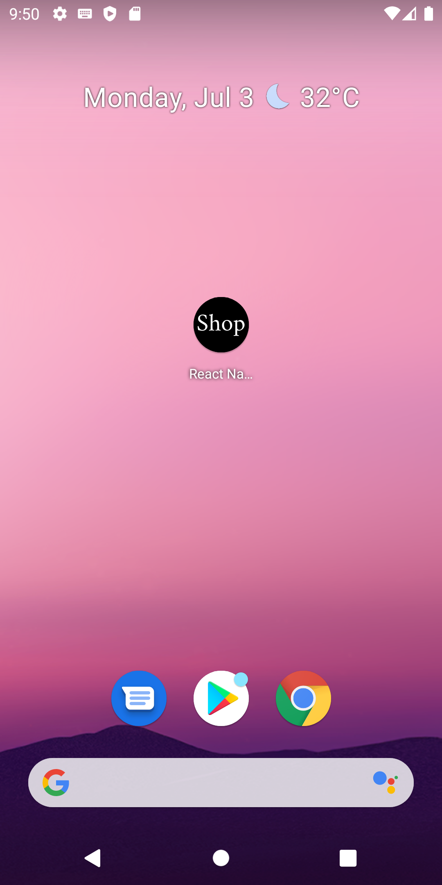
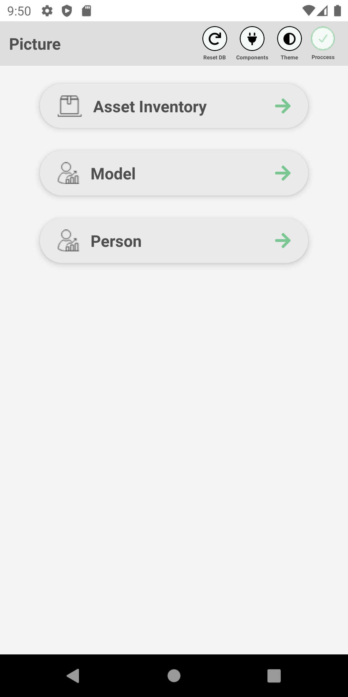
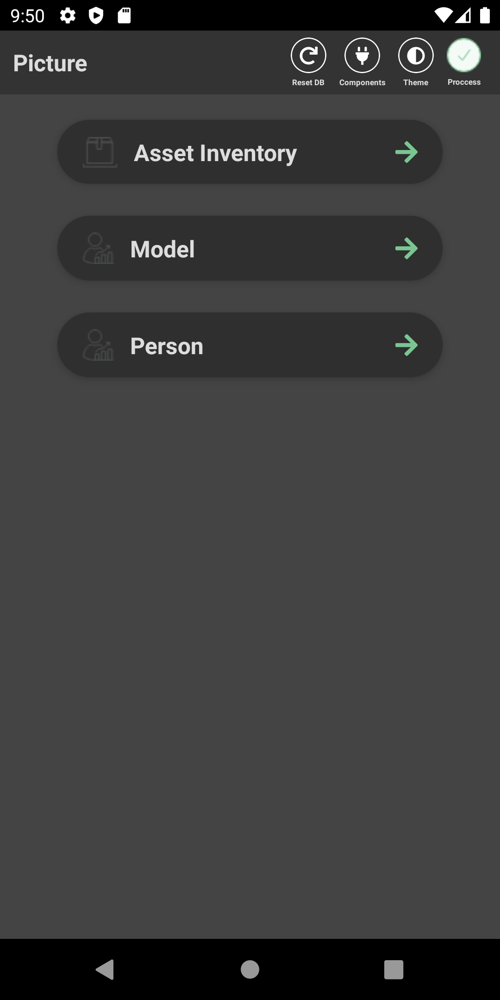
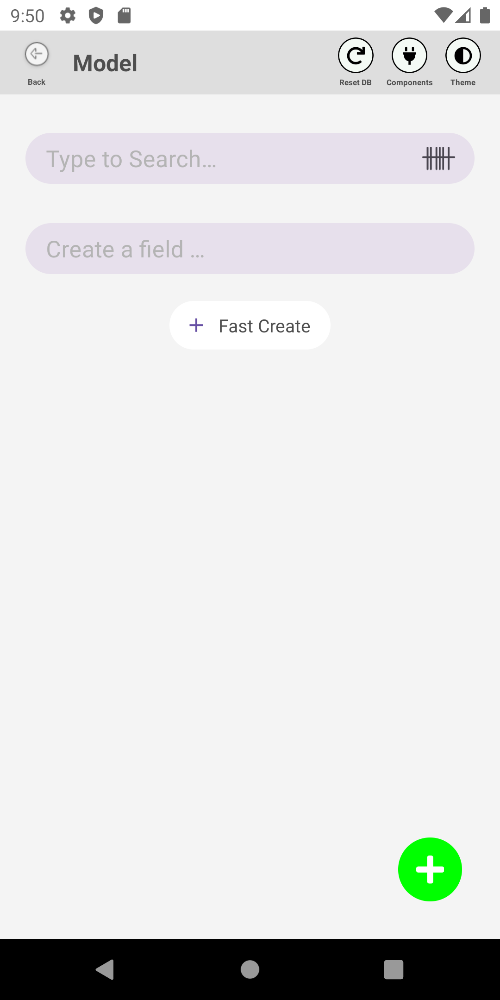
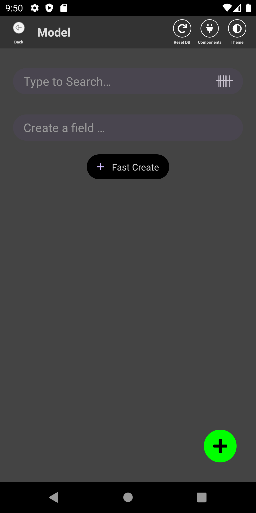
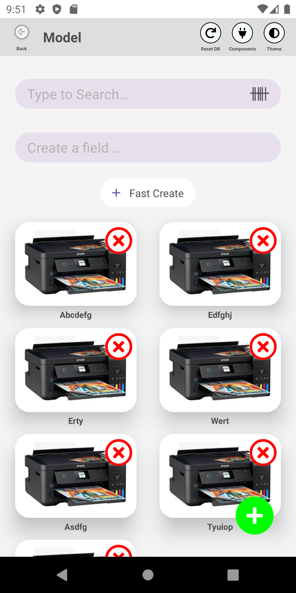
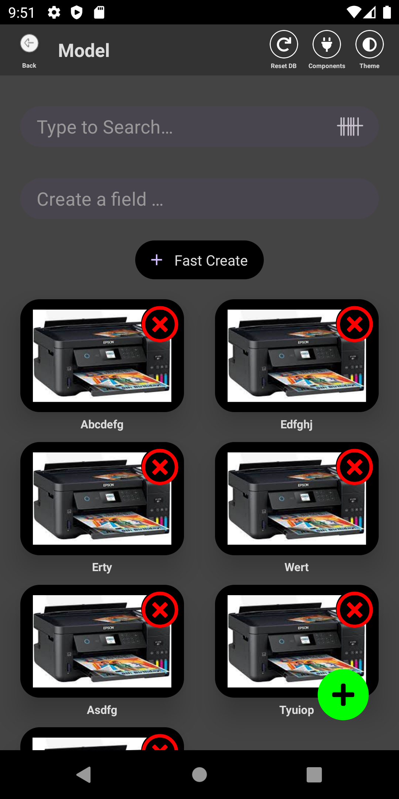
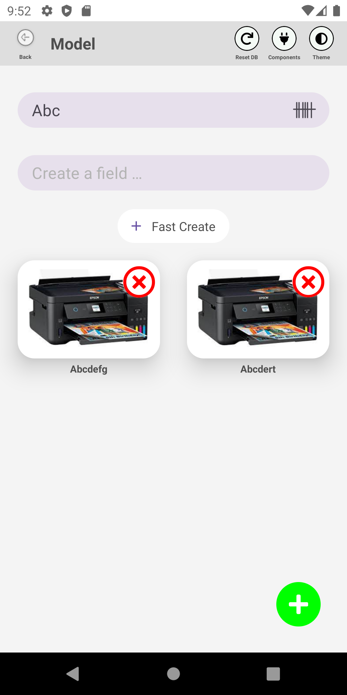
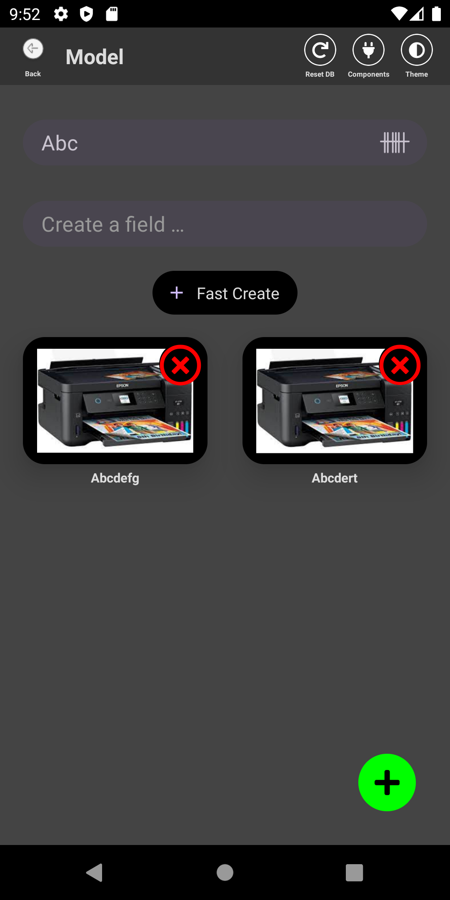
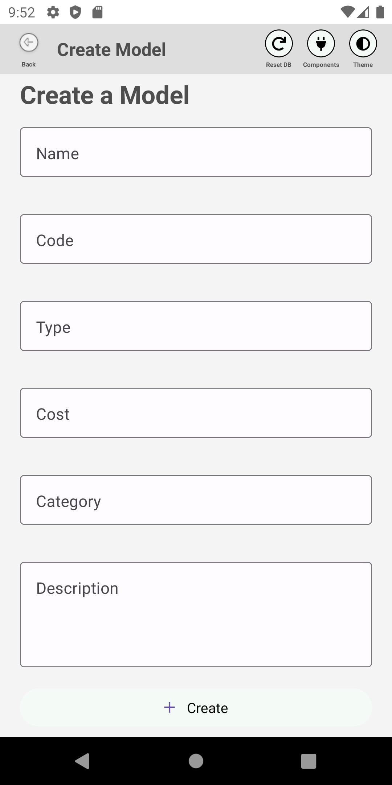
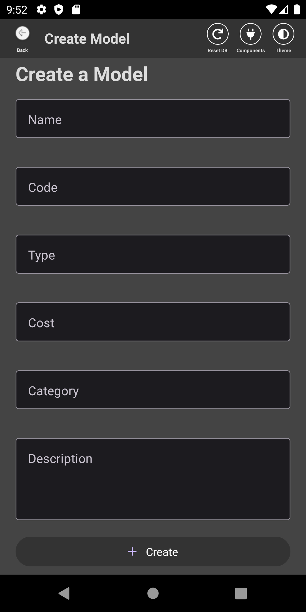
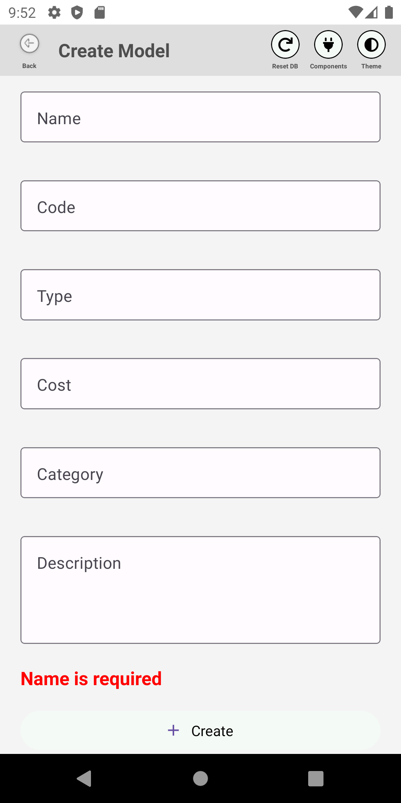
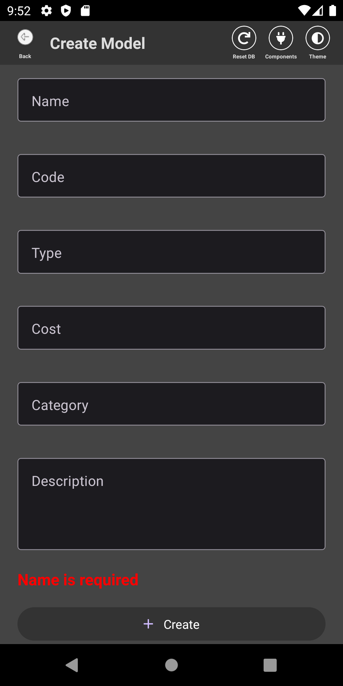
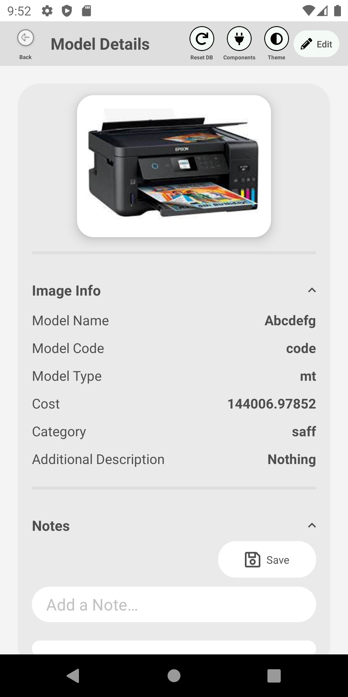
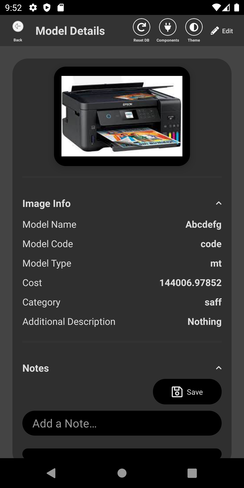
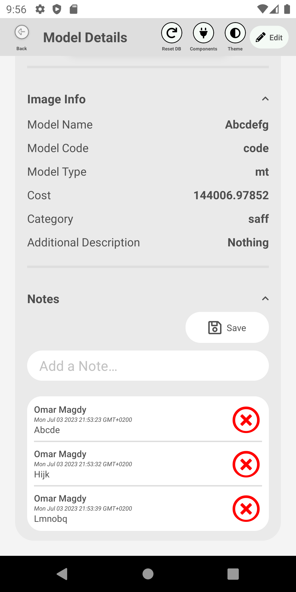
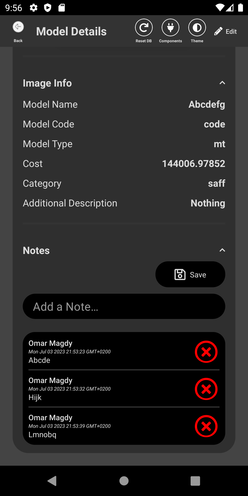
